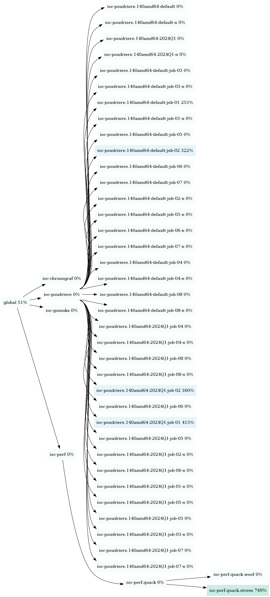

# Introduction

FreeBSD supports hierarchical, nested jails.

The `jgraph` tool uses the base system `jls(8)` to build a Graphviz digraph of this hierarchy.
It also uses `ps(1)` to collect the direct CPU utilization for each jail. Jails using more CPU are given a darker color.

# Example

One use is to visualize the state of all jails in a live fashion:

```sh
while jgraph; do sleep 2 ; done | dot -Txlib -Nfontsize=20 -Nshape=box
```


